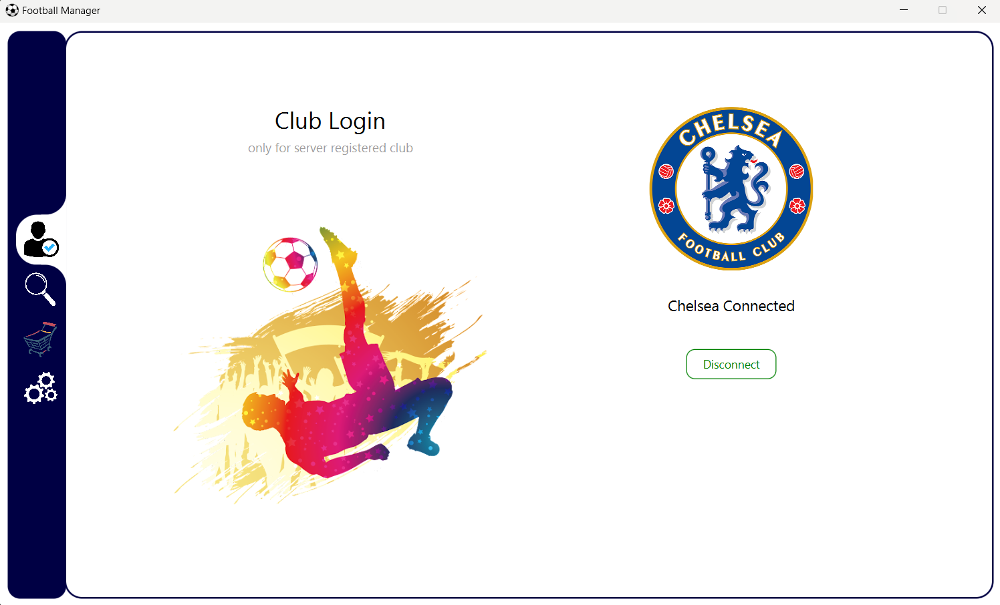

# Football-Player-Marketplace
CSE 108 JavaFx, Networking, Threading Project

# How to run:
1. Run "network/Server".
2. Run "sample/Main".
3. See "players.txt" file for available club name to connect.

# Project Screenshots:

